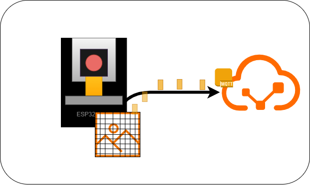
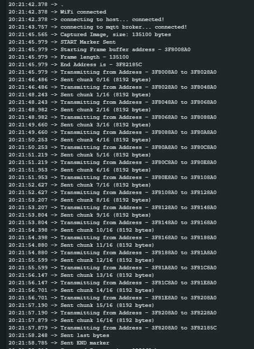
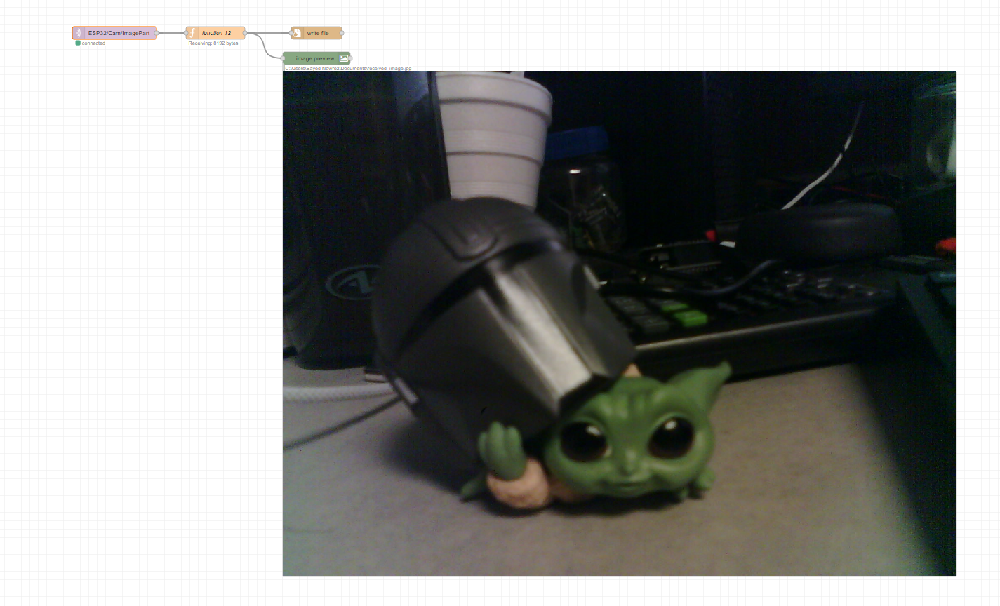
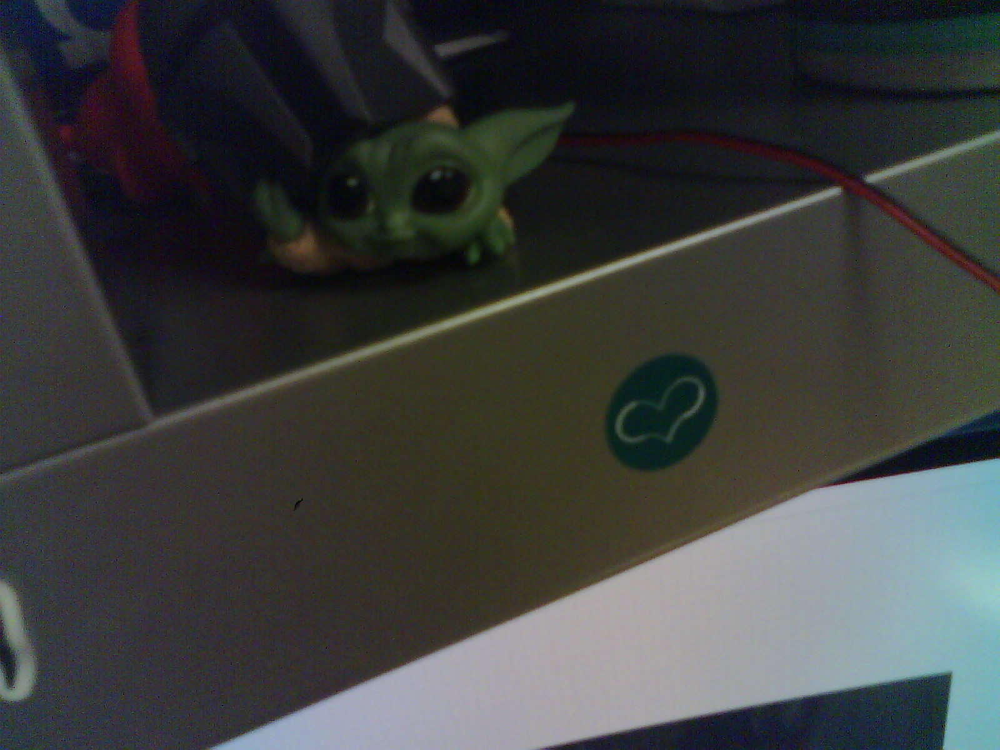

# Publishing High Resolution Images with ESP32-CAM and Node-Red
 

  

This repository contains ESP32-CAM firmware/Arduino Sketch to transmit High Resolution images over MQTT and Node-RED flow to receive and decode payloads back to image.

Full Details can be found at my Instructable Post: https://www.instructables.com/Receiving-and-Decoding-HD-Images-From-ESP32-CAM-Wi/ 

## Requirements
1. MQTT Library for ESP32-CAM: `MQTTPubSubClient` 
2. Node-RED palette: [node-red-contrib-image-output](https://flows.nodered.org/node/node-red-contrib-image-output) 

## Files
1. [BufferExtraction](./BufferExtraction) - Contains Arduino Sketch
2. [Node-Red-Flow](./Node-Red-Flow) - Contains Node-RED Flow File (for import) 

## How to use
1. Set WiFi and MQTT Credential at Arduino Sketch
2. Set your file path for saving image, inside the function block.   

## Notes
You may have to set maximum payload size, based on your Broker's maximum size.

## Demos

### ESP32-CAM Logs of transmission

### Node-RED Flow of Image Reception

### Sample Received Image (Resized)

